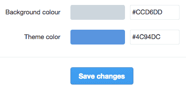

# Twitter Chrome Extension v1.0.2

- hides promoted tweets
- shows tweet actions only on hover
- fades out side bar widgets
- navigation color changed to twitter blue
- background color changed to grey
- tweet box color changed to grey
- hide translate button

## Screenshot

## Installation

1. **[Download](https://github.com/maxhoffmann/twitter-chrome-extension/archive/master.zip)**, unzip the latest release and save it.
2. Drag and drop it in Chrome’s `Settings > Extensions`.
3. Update user colors. (see below)

__Note:__ If you delete the folder with the extension on your computer it will also be removed from Chrome too.

#### Update your user colors to match design

1. Go to https://twitter.com/settings/design.
2. Set Background color to `#CCD6DD`.
3. Set Theme color to `#55ACEE`.
4. Click `Save changes`.

## License

Licensed under [MIT](LICENSE) by [@max_hoffmann](https://twitter.com/max_hoffmann).
